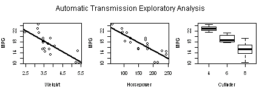
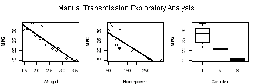
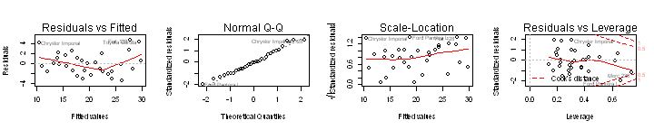

Regression Models Course Project
========================================================


**Executive Summary**
This report analysis is done to answer the question, are manual or automatic transmissions better for mile per gallon. Through a series of regression, coeffient, and other analysis I conclude that manual transmissions are better for miles per gallon. It must be noted though that the most obvious flaw in choosing manual over automatic transmission that is not captured in this analysis is the human factor as these figures have the potential to change drastically depending on the driver of the vehicle. Please read further to understand my conclusions.

**Data Summary**
The data that will be used for this analysis is the mtcars dataset that is pre-loaded into R. the data consist of 32 observations with 11 different measurable variables from mpg, weight, gears, etc. Each observation is done from a differnt model car, and in most cases the make is also different.

**Exploratory Analysis**
We begin by starting with some basic exploratory anaysis to get an immediate sense and feel of the data. The first thing we see is that the mean miles per gallon is greater for a manual transmission than automatic for the cars tested. The automatic value is 17.1474 and the value for manual is 24.3923. This can be caused by several fator that we will explore in further detail later in the analysis. We see from the exporatory analysis *(figure.1)* using some of the most correlated variables between mpg that there is a decent amount of variance from the regression for both manual and automatic transmissions using variables weight and horse power. Automatic transmissions have mroe variablility along a weight axis than manual and weight seems to have a greater impact on MPG for automatic. We will try and explain why later in the analysis. We also see that when compared to horse power mpg is greaterly impacted by an automatic transmission. This could be due to several factors such as the drivers of the vehicle or being able to control the RPMs when driving a manual vehicle. In the box plot comparing mpg and cyl manual transmission also fared better with higher median values of mpg for each cylinder factor (4,6,8). 

**Coefficient Analysis**
Next we want to run a coefficient anaylsis using mpg as the outcome and initially all variables as predictors. Using all variable as predictors we see that there are different postitive and negative associations for different variables *(Figure.2)*. Reviewing manual transmissions first we see gear has the highest postitive association to mpg and that carb has the lowest negative association. But for manual transmission both gear and carb have negative associations. Suprisingly horsepower for both transmission types have positive coefficients for mpg meaning that an increase in horsepower would have a positive effect on mpg. That hypothesis would normally be rejected if asked to the general population. We also see for both transmission that our t-test values are significant and likewaise that our p values are large. We will closer into the gear coefficient since it produced the highest positive association by creating regression of only mpg and gear *(Figure.3)*. Again we see that there is a positive, but less positive, relationship with mpg for automatic transmission and very suprisingly our sign has flipped for manual transmissions giving a negative association for gear and mpg when disregarding other variable coefficients. This could be because the gears are user controlled where they are obviously automatic in the other transmission type.

**Confidence and Prediction Test**
Next we will conduct confidence test with mpg as the outcome and using weight as the predictor. Weight is chosen due to the strong and polarizing, between manual and automatic, coefficient values when holding all other variables constant. At different weights of 2,3,4,5 and 6 (measured in tons) we see interesting results *(Figure.4)*. For the lightest weight the fit for our confidence interval is greater for mpg in manual transmission but the proportion of the difference is greatly reduced as the weight of the vechicle increases. Very suprisingly at the heaviest weight automatic fits the greater mpg confidence and the sign is reversed for manual. In our prediction test using mpg as the outcome and horsepower as the predictor we se very interesting results *(Figure.5)*. Horsepower is chosen for perdiction due to the naturally perceived correlation between the two as well as due to the coefficient values from our regression test. We see that ovreall horsepower has less of an impact on mpg for automatic than manual transmissions for the fitted values. But make note that the upper and lower ranges for automatic vary at an almost 2-1 proportion than that of manual transmissions creating much larger ranges for the valuation.

**Residual and Diagnostic Test**
Analysing the assumptions of our regression using diagnostical plots with our assumptions of a linear regression relationship *(Figure.6)*. The upper left plot shows the residuals versus the fitted values. If there was no scatter, which we know is false, all points would fall on the gray horizontal dashed line. We we were hoping to see a flatter smooth line through the plot but is slgihtly curved, not to an alarming level, but enough to create suspiscion of the fit of the linear model for this data. The upper right plot is a quantile plot of the residuals. As hoped the points lie very close to the dashed line meaning that the residuals are approximately normally distributed. The lower left plot are of the rescaled residuals so they have a mean of 0 and variance of 1. The regression assumes homoscedasticity, that the variance doesn't change as a function of x. If our assumption is correct the smooth line should be  relatively flat which it is thus confirming the assumption. The lower right shows the standardized residuals against leverage. For the lower right plot We normally would want to see the smooth red line lie close to the horizontal dashed line showing , but our plot varies around the horizontal line meaning that there are values that are leveraging their influence on the dataset. Looking at the top 10 dfbeta values which measure the change in the slope coefficient if the value is removed we see *(Figure.7)* there are, relatively, a few values that change the slop if the value is not included, but looks like nothing is too severe for cause of much concern.

**Conclusion**
We can therefore concclude that manual transmission are better for miles per gallon due to the greater mean, better ralative coefficients and significantly better confidence and prediction test. 


**Appendix**

Figure.1

  

Figure.2

```
##      Estimate Std. Error t value Pr(>|t|)
## cyl  -0.16809    0.63646 -0.2641  0.79707
## disp -0.02034    0.01669 -1.2189  0.25087
## hp    0.06630    0.04301  1.5416  0.15421
## drat  1.20221    2.48904  0.4830  0.63949
## wt    2.02595    2.12885  0.9517  0.36370
## qsec -0.72753    0.62245 -1.1688  0.26958
## vs    1.10603    2.23955  0.4939  0.63207
## gear  8.92973    3.67050  2.4328  0.03528
## carb -5.05772    1.72098 -2.9389  0.01481
```

```
##      Estimate Std. Error t value Pr(>|t|)
## cyl   1.89139     5.6124  0.3370   0.7531
## disp -0.05729     0.1707 -0.3357   0.7540
## hp    0.06970     0.1125  0.6197   0.5690
## drat  0.94994     6.0743  0.1564   0.8833
## wt   -8.98277     6.5169 -1.3784   0.2402
## qsec  2.26287     2.4214  0.9345   0.4029
## vs   -4.81205     5.5355 -0.8693   0.4337
## gear -0.29632     2.7348 -0.1084   0.9189
## carb -1.16359     3.7145 -0.3133   0.7697
```

Figure.3

```
##                Estimate Std. Error t value  Pr(>|t|)
## automatic$gear    5.335      0.229   23.29 6.839e-15
```

```
##             Estimate Std. Error t value  Pr(>|t|)
## manual$gear    5.436     0.4853    11.2 1.038e-07
```

Figure.4

```
##      fit   lwr   upr
## 1 23.844 20.73 26.96
## 2 20.058 18.31 21.80
## 3 16.272 14.99 17.55
## 4 12.487 10.15 14.82
## 5  8.701  4.89 12.51
```

```
##       fit     lwr    upr
## 1 28.1259  26.131 30.121
## 2 19.0417  16.731 21.353
## 3  9.9574   5.267 14.648
## 4  0.8731  -6.473  8.219
## 5 -8.2111 -18.272  1.849
```

Figure.5

```
##        fit    lwr    upr
## 1 17.75430 13.006 22.503
## 2 14.79745  9.986 19.609
## 3 11.84060  6.762 16.920
## 4  8.88375  3.362 14.405
## 5  2.97006 -3.812  9.752
## 6  0.01321 -7.524  7.551
```

```
##      fit    lwr   upr
## 1 23.032 14.193 31.87
## 2 20.096 11.028 29.16
## 3 17.159  7.642 26.68
## 4 14.222  4.064 24.38
## 5  8.349 -3.532 20.23
## 6  5.412 -7.492 18.32
```

Figure.6

 

Figure.7

```
##  [1] 1.503 1.395 1.262 0.938 0.775 0.668 0.594 0.572 0.569 0.563
```
